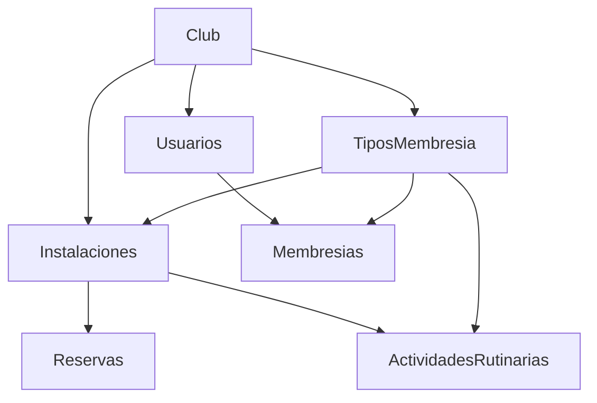
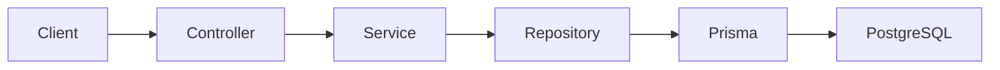

# Club API REST

API REST para la gestión integral de clubes deportivos: socios, atletas, trabajadores, instalaciones, reservas, actividades rutinarias, membresías y reportes.

Cada club opera de forma aislada. La API expone endpoints REST documentados con Swagger y protegidos con JWT.

**Enlaces rápidos**

| Recurso | Ubicación |
|---------|-----------|
| Swagger interactivo | `http://localhost:3000/api/docs` |
| Reglas de negocio completas | [`reglas_negocio.md`](reglas_negocio.md) |
| Arquitectura y base de datos | [`arquitectura_sistema.md`](arquitectura_sistema.md) |

---

## Stack tecnológico

| Tecnología | Uso |
|------------|-----|
| NestJS 11 | Framework HTTP |
| TypeScript 5 | Lenguaje |
| Prisma 7 + `@prisma/adapter-pg` | ORM |
| PostgreSQL | Base de datos |
| JWT + bcrypt | Autenticación |
| class-validator / class-transformer | Validación de DTOs |
| Swagger (`@nestjs/swagger`) | Documentación interactiva |
| Jest | Tests unitarios y e2e |

---

## Cómo arrancar el proyecto

### 1. Instalar dependencias

```bash
npm install
```

### 2. Configurar variables de entorno

Crear un archivo `.env` en la raíz con al menos:

| Variable | Descripción |
|----------|-------------|
| `DATABASE_URL` | Connection string de PostgreSQL |
| `JWT_SECRET` | Secreto para firmar tokens JWT |
| `PORT` | Puerto del servidor (default: `3000`) |
| `IS_TESTING` | Si es `true`, el seed carga datos de demo |

### 3. Migrar y poblar la base de datos

```bash
npm run db:setup
```

Esto ejecuta `prisma migrate deploy` y luego el seed. El seed **solo inserta datos de prueba** cuando `IS_TESTING=true`.

### 4. Levantar el servidor

```bash
npm run start:dev
```

La API queda disponible en `http://localhost:3000` y Swagger en `http://localhost:3000/api/docs`.

### Credenciales de prueba (seed)

- Contraseña de todos los usuarios demo: `demo1234`
- Tipos de usuario: `1` = trabajador, `2` = socio, `3` = atleta
- Por club hay 5 trabajadores, 5 socios y 5 atletas

---

## Reglas de negocio (resumen)

Esta sección resume las reglas principales en lenguaje claro. Para el detalle completo (campos obligatorios, validaciones, diagramas), ver [`reglas_negocio.md`](reglas_negocio.md).

### Principios generales

- Cada club gestiona **solo sus propios datos**, identificados por `clubId`.
- Los IDs se **generan automáticamente**; el cliente no los envía al crear registros.
- En producción, el `clubId` proviene de la **variable de entorno** del despliegue (una instancia por club).

### Tipos de usuario

| typeId | Rol | Descripción |
|--------|-----|-------------|
| 1 | Trabajador | Personal del club |
| 2 | Socio | Miembro estándar |
| 3 | Atleta | Miembro con datos deportivos y médicos extendidos |

### Tipos de membresía

Planes comerciales del club con **nombre** y **precio**. Cada club define los suyos (Básico, Premium, VIP, etc.).

### Socios y atletas

- `document` y `email` son **únicos por club**.
- **Eliminar** un socio o atleta no borra el registro: lo deja **inactivo** (`isActive: false`).
- Los **atletas** deben completar datos adicionales obligatorios: género, peso, altura, fecha de nacimiento, dieta, plan de entrenamiento e historial médico completo.

### Trabajadores

- Todos los campos son obligatorios: salario, horas por día, fecha de inicio de empleo, hora de entrada y hora de salida.
- **Eliminar** un trabajador también es baja lógica (`isActive: false`).

### Membresías

Suscripción de un socio/atleta a un plan. La fecha de vencimiento se calcula automáticamente:

```
vencimiento = fecha de creación + 30 días
```

### Instalaciones

Espacios físicos del club (gimnasio, piscina, cancha…). Cada instalación define qué **tipos de membresía** habilitan reservas. El trabajador responsable y los asistentes son **opcionales**.

### Reservas

Uso puntual de una instalación en fecha y horario concretos.

- **No pueden solaparse** en la misma instalación y fecha (dos reservas no pueden compartir ni un minuto de horario).
- Solo se **eliminan** si aún no se completaron (fecha + hora de fin no pasaron).

### Actividades rutinarias

Clases o entrenamientos que se repiten semanalmente. Se definen por **día de la semana** y pueden tener varios bloques horarios en un mismo día.

- **No pueden solaparse** en la misma instalación y día de la semana.

### Mapa del dominio



---

## Autenticación

La mayoría de endpoints requieren un token JWT.

### Flujo

1. Hacer `POST /auth/login` con email, password y clubId.
2. Recibir un `accessToken` en la respuesta.
3. Enviar el token en cada request subsiguiente:

```
Authorization: Bearer <accessToken>
```

### Endpoints públicos (sin JWT)

- `GET /` — health check
- `POST /auth/login` — login
- `GET /reports/*` — reportes (sin guard hoy)
- `GET /time-entries`, `POST /time-entries`, etc. — fichadas (sin guard hoy)

---

## Arquitectura de capas

Cada módulo sigue el mismo patrón:



- **Controller:** recibe HTTP, valida DTOs, devuelve JSON.
- **Service:** lógica de negocio y orquestación.
- **Repository:** acceso a datos con Prisma.
- **DTOs:** objetos tipados de entrada (`request/`) y salida (`response/`).

### Convención de `clubId`

Hoy el `clubId` se envía como **query param** (`?clubId=1`) o dentro del **body** del request, según el endpoint. Ver la tabla de cada controlador.

---

## Tour por la API

A continuación, cada controlador con sus endpoints, DTOs y tipos.

---

### `/` — Health check

**Para qué sirve:** verificar que la API está en marcha.

**Autenticación:** no requerida.

| Método | Ruta | Descripción | Respuesta |
|--------|------|-------------|-----------|
| GET | `/` | Ping básico | `string` |

---

### `/auth` — Autenticación

**Para qué sirve:** iniciar sesión y obtener token JWT.

**Autenticación:** no requerida.

| Método | Ruta | Descripción | Entrada | Respuesta |
|--------|------|-------------|---------|-----------|
| POST | `/auth/login` | Login | `LoginRequestDto` | `LoginResponse` |

**LoginRequestDto**

| Campo | Tipo | Obligatorio |
|-------|------|-------------|
| `email` | `string` | Sí |
| `password` | `string` | Sí |
| `clubId` | `number` | Sí |

**LoginResponse**

| Campo | Tipo | Descripción |
|-------|------|-------------|
| `accessToken` | `string` | Token JWT |
| `role` | `string` | Rol del usuario |
| `clubId` | `number` | Club del usuario |
| `userTypeId` | `number?` | Tipo de usuario |
| `membershipTypeId` | `number?` | Tipo de membresía activa |
| `userId` | `number?` | ID del usuario |
| `email` | `string?` | Email |
| `document` | `string?` | Documento |

---

### `/users` — Usuarios

**Para qué sirve:** gestionar socios (typeId=2), atletas (typeId=3) y trabajadores (typeId=1) del club.

**Autenticación:** JWT requerido.

| Método | Ruta | Descripción | Entrada | Respuesta |
|--------|------|-------------|---------|-----------|
| POST | `/users` | Crear usuario | `CreateUserDto` (body) | `UserResponseDto` |
| GET | `/users?clubId=` | Listar usuarios del club | query: `clubId` | `UserResponseDto[]` |
| GET | `/users/:id?clubId=&typeId=` | Obtener usuario | query: `clubId`, `typeId` | `UserResponseDto` |
| PATCH | `/users/:id` | Actualizar usuario | `UpdateUserDto` (body) | `UserResponseDto` |
| DELETE | `/users/:id?clubId=&typeId=` | Baja lógica (`isActive: false`) | query: `clubId`, `typeId` | `UserResponseDto` |

**CreateUserDto — campos comunes**

| Campo | Tipo | Obligatorio | Notas |
|-------|------|-------------|-------|
| `name` | `string` | Sí | Nombre completo |
| `typeId` | `number` | Sí | 1=trabajador, 2=socio, 3=atleta |
| `clubId` | `number` | Sí | |
| `document` | `string` | Sí | Único por club |
| `email` | `string?` | No | Único por club si se envía |
| `password` | `string?` | No | Se hashea con bcrypt |
| `isActive` | `boolean` | Sí | |
| `createdAt` | `string?` | No | ISO date |

**Campos adicionales para trabajador (typeId=1)**

| Campo | Tipo |
|-------|------|
| `salary` | `number` |
| `hoursToWorkPerDay` | `number` |
| `employmentStartDate` | `Date` |
| `startWorkAt` | `string` (HH:mm) |
| `endWorkAt` | `string` (HH:mm) |

**Campos adicionales para atleta (typeId=3)**

| Campo | Tipo |
|-------|------|
| `weight` | `number` |
| `height` | `number` |
| `gender` | `string` |
| `birthDate` | `Date` |
| `diet` | `string` |
| `trainingPlan` | `string` |
| `medicalHistory` | `string` |
| `allergies` | `string` |
| `medications` | `string` |
| `medicalConditions` | `string` |

**UserResponseDto**

Devuelve todos los campos anteriores más navegaciones anidadas:

| Campo | Tipo | Descripción |
|-------|------|-------------|
| `id` | `number` | |
| `type` | `UserTypeResponseDto?` | `{ id, name }` |
| `membership` | `object?` | Última membresía del usuario |
| `facilities` | `FacilityNavigation[]?` | Instalaciones donde trabaja |
| `scheduleActivities` | `object[]?` | Actividades rutinarias asignadas |

---

### `/user-type` — Tipos de usuario

**Para qué sirve:** catálogo de tipos de usuario (Worker, Member, Athlete). Es un catálogo global, no por club.

**Autenticación:** JWT requerido.

| Método | Ruta | Descripción | Entrada | Respuesta |
|--------|------|-------------|---------|-----------|
| GET | `/user-type?clubId=` | Listar tipos | query: `clubId` | `UserTypeResponseDto[]` |
| POST | `/user-type` | Crear tipo | `CreateUserTypeDto` | `UserTypeResponseDto` |
| GET | `/user-type/:id` | Obtener por ID | — | `UserTypeResponseDto` |

**UserTypeResponseDto:** `{ id: number, name: string }`

---

### `/membership-type` — Tipos de membresía

**Para qué sirve:** definir planes comerciales del club (nombre + precio).

**Autenticación:** JWT requerido.

| Método | Ruta | Descripción | Entrada | Respuesta |
|--------|------|-------------|---------|-----------|
| GET | `/membership-type?clubId=` | Listar planes | query: `clubId` | `MembershipTypeResponseDto[]` |
| POST | `/membership-type` | Crear plan | `CreateMembershipTypeDto` | `MembershipTypeResponseDto` |
| GET | `/membership-type/:id?clubId=` | Obtener plan | query: `clubId` | `MembershipTypeResponseDto` |
| PATCH | `/membership-type/:id?clubId=` | Actualizar plan | `UpdateMembershipTypeDto` | `MembershipTypeResponseDto` |
| DELETE | `/membership-type/:id?clubId=` | Eliminar plan | query: `clubId` | — |

**CreateMembershipTypeDto**

| Campo | Tipo | Obligatorio |
|-------|------|-------------|
| `name` | `string` | Sí |
| `price` | `number` | Sí (≥ 0) |
| `clubId` | `number` | Sí |

**MembershipTypeResponseDto:** `{ id: number, name: string, price: number }`

---

### `/membership` — Membresías

**Para qué sirve:** registrar la suscripción de un socio/atleta a un plan. El vencimiento se calcula solo (+30 días).

**Autenticación:** JWT requerido.

| Método | Ruta | Descripción | Entrada | Respuesta |
|--------|------|-------------|---------|-----------|
| POST | `/membership` | Crear membresía | `CreateMembershipDto` | `MembershipResponseDto` |
| GET | `/membership?clubId=` | Listar membresías | query: `clubId` | `MembershipResponseDto[]` |
| GET | `/membership/:id?clubId=` | Obtener membresía | query: `clubId` | `MembershipResponseDto` |
| PATCH | `/membership/:id?clubId=` | Actualizar | `UpdateMembershipDto` | `MembershipResponseDto` |
| DELETE | `/membership/:id?clubId=` | Eliminar | query: `clubId` | `MembershipResponseDto` |

**CreateMembershipDto**

| Campo | Tipo | Descripción |
|-------|------|-------------|
| `type` | `number` | ID del tipo de membresía |
| `userId` | `number` | ID del socio/atleta |
| `userTypeId` | `number` | 2=socio, 3=atleta |
| `clubId` | `number` | |

**MembershipResponseDto**

| Campo | Tipo | Descripción |
|-------|------|-------------|
| `id` | `number` | |
| `user` | `object` | Usuario titular anidado |
| `membershipType` | `object` | Plan `{ id, name, price }` |
| `createdAt` | `Date` | Fecha de alta |
| `expiration` | `Date` | Vencimiento (createdAt + 30 días) |

---

### `/facilities` — Instalaciones

**Para qué sirve:** gestionar espacios físicos del club, sus trabajadores y qué membresías habilitan reservas.

**Autenticación:** JWT requerido.

| Método | Ruta | Descripción | Entrada | Respuesta |
|--------|------|-------------|---------|-----------|
| POST | `/facilities` | Crear instalación | `CreateFacilityDto` | `FacilityResponseDto` |
| GET | `/facilities?clubId=` | Listar instalaciones | query: `clubId` | `FacilityResponseDto[]` |
| GET | `/facilities/:id?clubId=` | Obtener instalación | query: `clubId` | `FacilityResponseDto` |
| PATCH | `/facilities/:id?clubId=` | Actualizar | `UpdateFacilityDto` | `FacilityResponseDto` |
| DELETE | `/facilities/:id?clubId=` | Eliminar | query: `clubId` | `FacilityResponseDto` |

**CreateFacilityDto**

| Campo | Tipo | Obligatorio | Notas |
|-------|------|-------------|-------|
| `type` | `string` | Sí | Nombre/tipo de instalación |
| `capacity` | `number` | Sí | Mínimo 4 |
| `responsibleWorker` | `number` | Sí* | ID del trabajador responsable |
| `assistantWorkers` | `number[]?` | No | IDs de asistentes |
| `membershipTypeIds` | `number[]` | Sí | Planes que habilitan reserva |
| `isActive` | `boolean?` | No | Default `true` |
| `clubId` | `number` | Sí | |

\* El DTO actual lo exige; la regla de negocio lo marca como opcional (ver [`reglas_negocio.md`](reglas_negocio.md)).

**FacilityResponseDto**

| Campo | Tipo | Descripción |
|-------|------|-------------|
| `id` | `number` | |
| `type` | `string` | |
| `capacity` | `number` | |
| `responsibleWorker` | `UserNavigation \| null` | Trabajador responsable |
| `assistantWorkers` | `UserNavigation[] \| null` | Asistentes |
| `isActive` | `boolean` | |
| `membershipTypes` | `{ id, name, price }[]` | Planes habilitados |
| `activities` | `object[]` | Reservas en la instalación |
| `scheduleActivities` | `object[]?` | Actividades rutinarias |

---

### `/facility-workers` — Trabajadores por instalación

**Para qué sirve:** asignar trabajadores a una o más instalaciones como asistentes.

**Autenticación:** JWT requerido.

| Método | Ruta | Descripción | Entrada | Respuesta |
|--------|------|-------------|---------|-----------|
| POST | `/facility-workers` | Asignar trabajador | `CreateFacilityWorkerDto` | `FacilityWorkerResponseDto` |
| PATCH | `/facility-workers/:id` | Actualizar asignación | `UpdateFacilityWorkerDto` | — |

**CreateFacilityWorkerDto**

| Campo | Tipo | Descripción |
|-------|------|-------------|
| `clubId` | `number` | |
| `facilityId` | `number[]` | Una o más instalaciones |
| `userId` | `number` | ID del trabajador |
| `userTypeId` | `number` | Debe ser `1` |

**FacilityWorkerResponseDto:** `{ clubId, facilityNavigation[], userNavigation }`

---

### `/activities` — Reservas

**Para qué sirve:** reservar una instalación en fecha y horario concretos. En código se llama "activity", en negocio es una **reserva**.

**Autenticación:** JWT requerido.

| Método | Ruta | Descripción | Entrada | Respuesta |
|--------|------|-------------|---------|-----------|
| POST | `/activities` | Crear reserva | `CreateActivityDto` | `ActivityResponseDto` |
| GET | `/activities?clubId=` | Listar reservas | query: `clubId` | `ActivityResponseDto[]` |
| GET | `/activities/:id?clubId=` | Obtener reserva | query: `clubId` | `ActivityResponseDto` |
| PATCH | `/activities/:id?clubId=` | Actualizar | `UpdateActivityDto` | `ActivityResponseDto` |
| DELETE | `/activities/:id?clubId=` | Eliminar reserva | query: `clubId` | `ActivityResponseDto` |

> **Nota:** hoy el DELETE elimina físicamente sin verificar si la reserva ya se completó. La regla objetivo exige rechazar eliminaciones de reservas pasadas (ver [`reglas_negocio.md`](reglas_negocio.md)).

**CreateActivityDto**

| Campo | Tipo | Obligatorio | Notas |
|-------|------|-------------|-------|
| `name` | `string` | Sí | |
| `type` | `string` | Sí | Categoría |
| `date` | `Date` | Sí | |
| `hourStart` | `string` | Sí | Formato `HH:mm` |
| `hourEnd` | `string` | Sí | Formato `HH:mm`, debe ser > hourStart |
| `userId` | `number` | Sí | Quien reserva |
| `userTypeId` | `number` | Sí | Tipo del reservante |
| `facilityId` | `number` | Sí | |
| `cost` | `number` | Sí | ≥ 0 |
| `isActive` | `boolean?` | No | Default `true` |
| `clubId` | `number` | Sí | |

**ActivityResponseDto**

| Campo | Tipo | Descripción |
|-------|------|-------------|
| `id` | `number` | |
| `name`, `type` | `string` | |
| `date` | `Date` | |
| `hourStart`, `hourEnd` | `string` | |
| `cost` | `number` | |
| `isActive` | `boolean` | |
| `clubId` | `number` | |
| `user` | `UserNavigation \| null` | Quien reservó |
| `facility` | `FacilityNavigation` | Instalación con trabajadores y membresías |

---

### `/scheduled-activities` — Actividades rutinarias

**Para qué sirve:** programar clases o entrenamientos recurrentes por día de la semana en una instalación.

**Autenticación:** JWT requerido.

| Método | Ruta | Descripción | Entrada | Respuesta |
|--------|------|-------------|---------|-----------|
| POST | `/scheduled-activities` | Crear actividad | `CreateScheduledActivityDto` | `ScheduledActivityResponseDto` |
| GET | `/scheduled-activities?clubId=` | Listar actividades | query: `clubId` | `ScheduledActivityResponseDto[]` |
| GET | `/scheduled-activities/working-days?clubId=` | Días laborales del club | query: `clubId` | `{ id, dayOfWeek }[]` |
| GET | `/scheduled-activities/:id?clubId=` | Obtener actividad | query: `clubId` | `ScheduledActivityResponseDto` |
| PATCH | `/scheduled-activities/:id?clubId=` | Actualizar | `UpdateScheduledActivityDto` | `ScheduledActivityResponseDto` |
| DELETE | `/scheduled-activities/:id?clubId=` | Eliminar | query: `clubId` | — |

**CreateScheduledActivityDto**

| Campo | Tipo | Obligatorio | Notas |
|-------|------|-------------|-------|
| `clubId` | `number` | Sí | |
| `facilityId` | `number` | Sí | |
| `name` | `string` | Sí | |
| `userId` | `number` | Sí | Trabajador responsable |
| `userTypeId` | `number` | Sí | Debe ser `1` |
| `membershipTypesIds` | `number[]` | Sí | Planes incluidos |
| `datetimeScheduledActivities` | `object[]` | Sí | Horarios (ver abajo) |
| `assistantWorkerIds` | `number[]` | Sí | Asistentes |

**datetimeScheduledActivities** (cada elemento):

| Campo | Tipo | Descripción |
|-------|------|-------------|
| `workingDayId` | `number` | ID del día (`working_days`) |
| `hourStart` | `string` | HH:mm |
| `hourEnd` | `string` | HH:mm |

**ScheduledActivityResponseDto**

| Campo | Tipo |
|-------|------|
| `id` | `number` |
| `clubId` | `number` |
| `name` | `string` |
| `facility` | `FacilityNavigation` |
| `userId` | `number` |
| `user` | `UserNavigation` |
| `userTypeId` | `number` |
| `assistantWorkers` | `UserNavigation[]` |
| `membershipTypes` | `{ id, name, price }[]` |
| `datetimeScheduledActivities` | `{ hourStart, hourEnd, workingDayId }[]` |

---

### `/time-entries` — Fichadas

**Para qué sirve:** registrar entradas y salidas de trabajadores (control horario).

**Autenticación:** no requerida hoy (sin `@UseGuards`).

| Método | Ruta | Descripción | Entrada | Respuesta |
|--------|------|-------------|---------|-----------|
| POST | `/time-entries` | Registrar fichada | `CreateTimeEntryDto` | `TimeEntryResponseDto` |
| GET | `/time-entries?clubId=` | Listar fichadas | query: `clubId` | `TimeEntryResponseDto[]` |
| GET | `/time-entries/:id` | Obtener fichada | — | `TimeEntryResponseDto` |
| PATCH | `/time-entries/:id` | Actualizar (ej. clockOut) | `UpdateTimeEntryDto` | `TimeEntryResponseDto` |

**CreateTimeEntryDto**

| Campo | Tipo | Obligatorio |
|-------|------|-------------|
| `userId` | `number` | Sí |
| `clubId` | `number` | Sí |
| `userDocument` | `string` | Sí |
| `clockIn` | `string` | Sí (ISO date) |
| `clockOut` | `string?` | No |

**TimeEntryResponseDto:** `{ id, clubId, user, userDocument, clockIn, clockOut? }`

---

### `/reports` — Reportes

**Para qué sirve:** consultas analíticas de salarios, ingresos y altas de usuarios.

**Autenticación:** no requerida hoy (sin `@UseGuards`).

| Método | Ruta | Descripción | Query params | Respuesta |
|--------|------|-------------|--------------|-----------|
| GET | `/reports/salaries` | Reporte de salarios | `SalaryReportRequestDto` | `SalaryReportResponseDto` |
| GET | `/reports/monthIncome` | Ingresos del mes | `MonthIncomeReportRequestDto` | `MonthIncomeReportResponseDto` |
| GET | `/reports/newUsers` | Nuevos usuarios del mes | `NewUsersReportRequestDto` | `NewUsersReportResponseDto` |
| GET | `/reports/monthlyProgressionIncome` | Progresión de ingresos | `MonthlyProgressionIncomeReportRequestDto` | `MonthlyProgressionIncomeReportResponseDto` |

**SalaryReportRequestDto:** `{ userId, clubId, typeId }`

**SalaryReportResponseDto:** `{ user, salary, hoursWorked, hoursToWorkPerMonth, extraHours, totalSalary }`

**MonthIncomeReportRequestDto:** `{ clubId, date }`

**MonthIncomeReportResponseDto:** `{ month, monthIncomeTotal, monthIncomeMemberships, monthIncomeActivities }`

**NewUsersReportRequestDto:** `{ clubId, typeId, date }`

**NewUsersReportResponseDto:** `{ users: UserResponseDto[], totalUsers }`

**MonthlyProgressionIncomeReportRequestDto:** `{ clubId, dateStart, dateEnd }`

**MonthlyProgressionIncomeReportResponseDto:** `{ dateStart, dateEnd, totalIncome, totalIncomeMemberships, totalIncomeActivities, monthlyIncomes[] }`

---

## Scripts útiles

| Comando | Descripción |
|---------|-------------|
| `npm run start:dev` | Servidor en modo watch |
| `npm run start:prod` | Servidor en producción |
| `npm run build` | Compilar TypeScript |
| `npm run test` | Tests unitarios |
| `npm run test:e2e` | Tests end-to-end |
| `npm run test:cov` | Cobertura de tests |
| `npm run lint` | ESLint + fix |
| `npm run db:migrate` | Aplicar migraciones |
| `npm run db:seed` | Ejecutar seed |
| `npm run db:setup` | Migrar + seed |

---

## Documentación del proyecto

| Documento | Para qué sirve |
|-----------|----------------|
| **README.md** (este archivo) | Entrada rápida: negocio, tour de API, cómo arrancar |
| [`reglas_negocio.md`](reglas_negocio.md) | Reglas de negocio completas y detalladas |
| [`arquitectura_sistema.md`](arquitectura_sistema.md) | Arquitectura técnica, tablas Prisma, diagramas ER |
| `/api/docs` (Swagger) | Referencia interactiva de endpoints en runtime |
