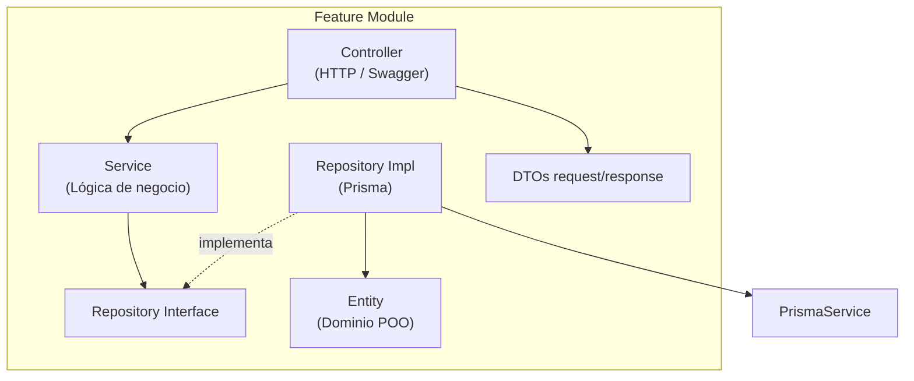
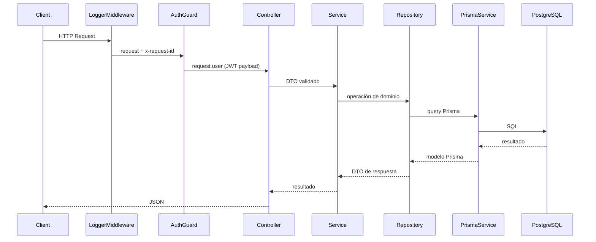
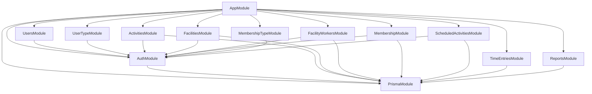
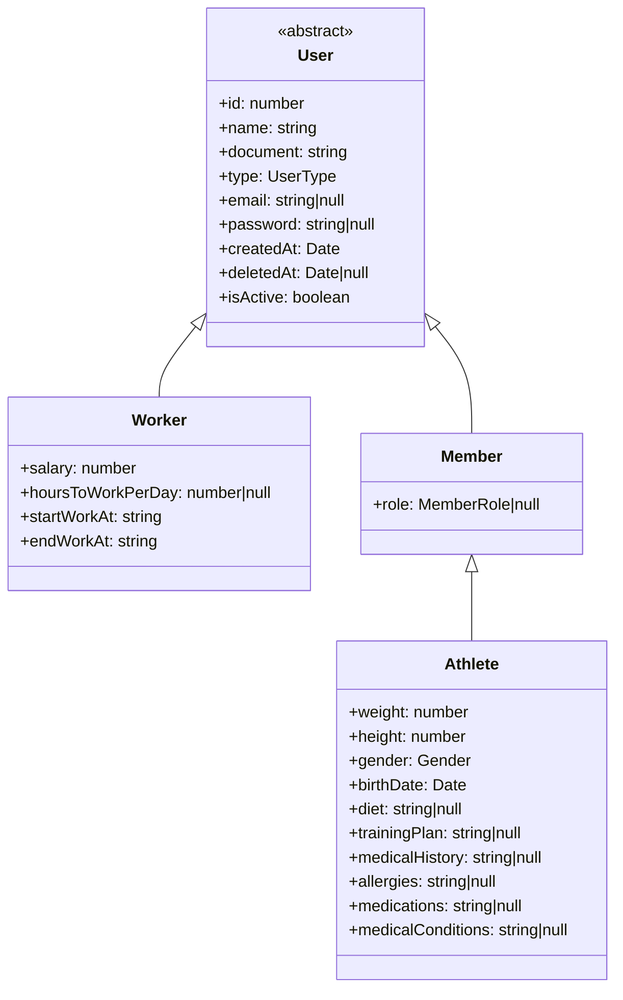
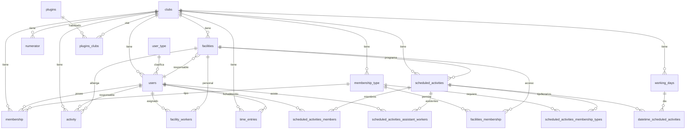

# Arquitectura del Sistema — Club API REST

Documentación técnica del proyecto **proyecto-club-api-rest**: API REST para la gestión integral de clubes deportivos.

---

## 1. Resumen del sistema

| Aspecto | Detalle |
|---------|---------|
| **Framework** | NestJS 11 |
| **ORM** | Prisma 7 con adapter `@prisma/adapter-pg` |
| **Base de datos** | PostgreSQL |
| **Autenticación** | JWT (`@nestjs/jwt`) + bcrypt |
| **Validación** | `class-validator` + `ValidationPipe` global |
| **Documentación API** | Swagger en `/api/docs` |
| **Patrón arquitectónico** | Organización orientada a features (módulos por dominio) |
| **Patrón de persistencia** | Repository (interface + implementación con Prisma) |
| **Multi-tenancy** | Aislamiento por `clubId` en casi todas las entidades |

La aplicación expone endpoints REST para administrar usuarios, instalaciones, actividades, membresías, fichadas de personal, actividades programadas y reportes financieros/operativos.

---

## 2. Estructura de carpetas

```
proyecto-club-api-rest/
├── prisma/
│   ├── schema.prisma          # Modelo de datos Prisma
│   ├── seed.ts                # Datos iniciales
│   └── migrations/            # Migraciones SQL versionadas
├── src/
│   ├── main.ts                # Bootstrap: pipes, filters, CORS, Swagger
│   ├── app.module.ts          # Módulo raíz
│   ├── app.controller.ts
│   ├── app.service.ts
│   │
│   ├── auth/                  # Autenticación JWT
│   │   ├── auth.module.ts
│   │   ├── auth.controller.ts
│   │   ├── auth.service.ts
│   │   ├── dto/
│   │   ├── entities/
│   │   └── guards/jwt-auth.guard.ts
│   │
│   ├── prisma/                # Módulo global de acceso a BD
│   │   ├── prisma.module.ts
│   │   └── prisma.service.ts
│   │
│   ├── common/                # Infraestructura transversal
│   │   ├── filters/all-exceptions.filter.ts
│   │   ├── interceptors/http-logging.interceptor.ts
│   │   ├── middleware/logger.middleware.ts
│   │   └── logging/sanitize-log-body.ts
│   │
│   ├── users/                 # Feature: usuarios
│   ├── user_type/             # Feature: tipos de usuario
│   ├── activities/            # Feature: actividades puntuales
│   ├── facilities/            # Feature: instalaciones
│   ├── facility_workers/      # Feature: trabajadores por instalación
│   ├── membership/            # Feature: membresías de usuarios
│   ├── membership_type/       # Feature: tipos de membresía
│   ├── scheduled_activities/  # Feature: actividades rutinarias
│   ├── time-entries/          # Feature: fichadas de personal
│   └── reports/               # Feature: reportes
│
└── test/                      # Tests e2e
```

### Estructura interna de cada feature

Cada módulo de dominio sigue la misma convención:

```
<feature>/
├── <feature>.module.ts
├── <feature>.controller.ts
├── <feature>.service.ts
├── dto/
│   ├── request/               # DTOs de entrada (create, update, query)
│   └── response/              # DTOs de salida
├── entities/                  # Clases de dominio (POO)
└── repository/
    ├── <feature>.repository.ts       # Interface + tipos de navegación
    └── <feature>.repository.impl.ts  # Implementación con Prisma
```

---

## 3. Arquitectura por features

El proyecto adopta una **arquitectura modular orientada a features**. Cada dominio de negocio es un módulo NestJS autocontenido con sus propias capas:



### Flujo de una petición



### Módulos de dominio

| Módulo | Ruta base | Descripción |
|--------|-----------|-------------|
| `auth` | `/auth` | Login y emisión de tokens JWT |
| `users` | `/users` | CRUD de usuarios (workers, members, athletes) |
| `user_type` | `/user-type` | Tipos de usuario del sistema |
| `activities` | `/activities` | Reservas/actividades puntuales |
| `facilities` | `/facilities` | Instalaciones del club |
| `facility_workers` | `/facility-workers` | Asignación de trabajadores a instalaciones |
| `membership` | `/membership` | Membresías activas de usuarios |
| `membership_type` | `/membership-type` | Catálogo de tipos de membresía |
| `scheduled_activities` | `/scheduled-activities` | Actividades rutinarias con horarios |
| `time-entries` | `/time-entries` | Fichadas de entrada/salida |
| `reports` | `/reports` | Reportes de salarios, ingresos y usuarios |

### Módulos transversales

| Módulo | Alcance | Rol |
|--------|---------|-----|
| `prisma` | Global (`@Global()`) | Conexión a PostgreSQL vía Prisma |
| `common` | App-wide | Logging, manejo de excepciones, sanitización |
| `auth` | Exportado | JWT + `AuthGuard` reutilizable |

---

## 4. Diagrama de dependencias entre módulos



---

## 5. Entidades del dominio

Las entidades son clases TypeScript orientadas a objetos que representan el modelo de negocio. Se ubican en `entities/` de cada feature y son independientes del schema Prisma (aunque reflejan su estructura).

### 5.1 Jerarquía de usuarios



**Archivos:** [`src/users/entities/user.entity.ts`](src/users/entities/user.entity.ts), [`worker.entity.ts`](src/users/entities/worker.entity.ts), [`member.entity.ts`](src/users/entities/member.entity.ts), [`athlete.entity.ts`](src/users/entities/athlete.entity.ts)

#### Enums de usuarios

| Enum | Valores | Uso |
|------|---------|-----|
| `UserType` | `WORKER=1`, `MEMBER=2`, `ATHLETE=3`, `ADMIN=4` | Discriminador de tipo en BD (`users.typeId`) |
| `MemberRole` | `Standard=1`, `VIP=2`, `ATHLETE=3` | Rol dentro de miembros |
| `Gender` | `male`, `female` | Datos deportivos de atletas |

> En base de datos, todos los tipos de usuario comparten la tabla `users`. Los campos específicos de worker (salary, horarios) y athlete (peso, historial médico) conviven en la misma fila según `typeId`.

### 5.2 Entidades restantes

#### Activity — Actividad puntual

| Campo | Tipo | Descripción |
|-------|------|-------------|
| `id` | `number` | Identificador |
| `name` | `string` | Nombre de la actividad |
| `type` | `string` | Tipo/categoría |
| `date` | `Date` | Fecha de la actividad |
| `hourStart` / `hourEnd` | `string` | Horario |
| `user` | `User` | Usuario responsable |
| `cost` | `number` | Costo |
| `facility` | `Facility` | Instalación donde se realiza |
| `isActive` | `boolean` | Estado activo/inactivo |

**Navegaciones:** `User`, `Facility`

#### Facility — Instalación

| Campo | Tipo | Descripción |
|-------|------|-------------|
| `id` | `number` | Identificador |
| `type` | `string` | Tipo de instalación |
| `capacity` | `number` | Capacidad |
| `responsibleWorker` | `Worker` | Trabajador responsable |
| `assistantWorker` | `Worker \| null` | Trabajador asistente |
| `isActive` | `boolean` | Estado |
| `membershipTypes` | `MembershipType[]` | Tipos de membresía permitidos |

**Navegaciones:** `Worker`, `MembershipType[]`, `Activity[]` (en BD)

#### Membership — Membresía de usuario

| Campo | Tipo | Descripción |
|-------|------|-------------|
| `id` | `number` | Identificador |
| `type` | `number` | ID del tipo de membresía |
| `expirationDate` | `Date` | Fecha de vencimiento |
| `clubId` | `number` | Club al que pertenece |
| `createdAt` | `Date` | Fecha de alta |

**Navegaciones:** `users`, `membership_type`

#### MembershipType — Tipo de membresía

| Campo | Tipo | Descripción |
|-------|------|-------------|
| `id` | `number` | Identificador |
| `name` | `string` | Nombre (Basic, VIP, etc.) |
| `price` | `number` | Precio |

**Navegaciones:** `membership[]`, `facilities_membership[]`, `scheduled_activities_membership_types[]`

#### TimeEntry — Fichada

| Campo | Tipo | Descripción |
|-------|------|-------------|
| `id` | `number` | Identificador |
| `clubId` | `number` | Club |
| `userId` | `number` | ID del usuario |
| `userDocument` | `string` | Documento del usuario |
| `user` | `User` | Usuario fichado |
| `clockIn` | `Date` | Hora de entrada |
| `clockOut` | `Date \| null` | Hora de salida |

**Navegaciones:** `users` (por documento + clubId)

#### UserType — Tipo de usuario (catálogo)

| Campo | Tipo | Descripción |
|-------|------|-------------|
| `id` | `number` | Identificador |
| `name` | `string` | Nombre (Worker, Member, Athlete, Admin) |

**Navegaciones:** `users[]`

#### Entidades vacías / pendientes

| Entidad | Archivo | Estado |
|---------|---------|--------|
| `FacilityWorker` | `facility_workers/entities/facility_worker.entity.ts` | Clase vacía; lógica en DTOs/repository |
| `ScheduledActivity` | `scheduled_activities/entities/scheduled_activity.entity.ts` | Clase vacía; lógica en DTOs/repository |

---

## 6. Estructura de tablas (Prisma / PostgreSQL)

Todas las tablas de negocio (excepto `user_type` y `plugins`) están acotadas por `clubId`, implementando multi-tenancy a nivel de fila.

### 6.1 Tabla raíz: `clubs`

| Columna | Tipo | Restricción | Descripción |
|---------|------|-------------|-------------|
| `id` | `Int` | **PK** | Identificador del club |
| `name` | `String` | | Nombre |
| `address` | `String` | | Dirección |
| `phone` | `String` | | Teléfono |
| `email` | `String` | | Email |
| `website` | `String` | | Sitio web |
| `logo` | `String?` | | URL del logo |
| `isActive` | `Boolean` | | Estado |

**Relaciones hijas:** `users`, `facilities`, `activities`, `membership`, `membership_type`, `time_entries`, `numerator`, `scheduled_activities`, `working_days`, `plugins_clubs`, tablas puente.

---

### 6.2 `user_type` (catálogo global)

| Columna | Tipo | Restricción |
|---------|------|-------------|
| `id` | `Int` | **PK** |
| `name` | `String` | |

**FK entrantes:** `users.typeId → user_type.id`

---

### 6.3 `users`

| Columna | Tipo | Restricción | Notas |
|---------|------|-------------|-------|
| `id` | `Int` | **PK compuesta** `[id, clubId, typeId]` | Auto-increment local |
| `clubId` | `Int` | **PK**, **FK → clubs.id** | Multi-tenant |
| `typeId` | `Int` | **PK**, **FK → user_type.id** | Discriminador |
| `name` | `String` | | |
| `document` | `String` | **UNIQUE** `[clubId, document]` | |
| `email` | `String?` | **UNIQUE** `[clubId, email]` | |
| `password` | `String?` | | Hash bcrypt |
| `createdAt` | `DateTime` | default `now()` | |
| `deletedAt` | `DateTime?` | | Soft delete |
| `isActive` | `Boolean` | | |
| `salary` | `Decimal(10,2)?` | | Solo workers |
| `hoursToWorkPerDay` | `Int?` | | Solo workers |
| `employmentStartDate` | `DateTime?` | | |
| `startWorkAt` / `endWorkAt` | `String?` | | Horario laboral |
| `weight`, `height` | `Decimal?` | | Solo athletes |
| `gender` | `String?` | | |
| `birthDate` | `DateTime?` | | |
| `diet`, `trainingPlan` | `String?` | | |
| `medicalHistory`, `allergies`, `medications`, `medicalConditions` | `String?` | | Datos médicos |
| `scheduledActivityId` | `Int?` | | Referencia opcional |

**FK salientes:** `clubId → clubs`, `typeId → user_type`

**FK entrantes:** `membership`, `activity`, `facility_workers`, `facilities` (responsable), `time_entries`, `scheduled_activities_members`, `scheduled_activities_assistant_workers`

---

### 6.4 `membership_type`

| Columna | Tipo | Restricción |
|---------|------|-------------|
| `id` | `Int` | **PK compuesta** `[id, clubId]` |
| `clubId` | `Int` | **PK**, **FK → clubs.id** |
| `name` | `String` | |
| `price` | `Decimal(10,2)` | default `0` |

**FK entrantes:** `membership`, `facilities_membership`, `scheduled_activities_membership_types`

---

### 6.5 `membership`

| Columna | Tipo | Restricción |
|---------|------|-------------|
| `id` | `Int` | **PK compuesta** `[id, clubId]` |
| `clubId` | `Int` | **PK**, **FK → clubs.id** |
| `membershipTypeId` | `Int` | **FK compuesta → membership_type[id, clubId]** |
| `userId` | `Int` | **FK compuesta → users[id, clubId, userTypeId]** |
| `userTypeId` | `Int` | Parte de FK compuesta hacia users |
| `createdAt` | `DateTime` | |
| `expiration` | `DateTime` | |

---

### 6.6 `facilities`

| Columna | Tipo | Restricción |
|---------|------|-------------|
| `id` | `Int` | **PK compuesta** `[id, clubId]` |
| `clubId` | `Int` | **PK**, **FK → clubs.id** |
| `type` | `String` | |
| `capacity` | `Int` | |
| `isActive` | `Boolean` | |
| `ResponsibleWorkerUserId` | `Int` | **FK compuesta → users[id, clubId, ResponsibleWorkerTypeId]** |
| `ResponsibleWorkerTypeId` | `Int` | Parte de FK hacia users |

**FK entrantes:** `activity`, `facilities_membership`, `facility_workers`, `scheduled_activities`

---

### 6.7 `facilities_membership` (tabla puente)

| Columna | Tipo | Restricción |
|---------|------|-------------|
| `id` | `Int` | **PK compuesta** `[id, clubId]` |
| `clubId` | `Int` | **PK**, **FK → clubs.id** |
| `facilityId` | `Int` | **FK compuesta → facilities[id, clubId]** |
| `membershipTypeId` | `Int` | **FK compuesta → membership_type[id, clubId]** |

Relaciona qué tipos de membresía pueden acceder a cada instalación.

---

### 6.8 `facility_workers`

| Columna | Tipo | Restricción |
|---------|------|-------------|
| `id` | `Int` | Parte de **PK compuesta** `[id, facilityId, userId, clubId, userTypeId]` |
| `clubId` | `Int` | **PK**, **FK → clubs.id** |
| `facilityId` | `Int` | **PK**, **FK compuesta → facilities[id, clubId]** |
| `userId` | `Int` | **PK**, **FK compuesta → users[id, clubId, userTypeId]** |
| `userTypeId` | `Int` | **PK**, parte de FK hacia users |

**UNIQUE:** `[facilityId, userId, clubId, userTypeId]`

---

### 6.9 `activity`

| Columna | Tipo | Restricción |
|---------|------|-------------|
| `id` | `Int` | **PK compuesta** `[id, clubId]` |
| `clubId` | `Int` | **PK**, **FK → clubs.id** |
| `name` | `String` | |
| `type` | `String` | |
| `date` | `DateTime` | |
| `hourStart` / `hourEnd` | `String` | |
| `userId` | `Int` | **FK compuesta → users[id, clubId, userTypeId]** |
| `userTypeId` | `Int` | Parte de FK hacia users |
| `cost` | `Decimal(10,2)` | |
| `facilityId` | `Int` | **FK compuesta → facilities[id, clubId]** |
| `isActive` | `Boolean` | |

---

### 6.10 `time_entries`

| Columna | Tipo | Restricción |
|---------|------|-------------|
| `id` | `Int` | **PK** simple |
| `clubId` | `Int` | **FK → clubs.id** |
| `userId` | `Int` | Referencia lógica al usuario |
| `userDocument` | `String` | **FK compuesta → users[document, clubId]** |
| `clockIn` | `DateTime` | |
| `clockOut` | `DateTime?` | |

---

### 6.11 `numerator` (secuencias por club)

| Columna | Tipo | Restricción |
|---------|------|-------------|
| `id` | `Int` | **PK** |
| `name` | `String` | Nombre del numerador (ej. `userId`, `activityId`) |
| `clubId` | `Int` | **FK → clubs.id** |
| `value` | `Int` | Último valor generado |

---

### 6.12 `scheduled_activities`

| Columna | Tipo | Restricción |
|---------|------|-------------|
| `id` | `Int` | **PK compuesta** `[id, clubId]` |
| `clubId` | `Int` | **PK**, **FK → clubs.id** |
| `facilityId` | `Int` | **FK compuesta → facilities[id, clubId]** |
| `userId` | `Int` | Responsable (sin FK explícita en schema) |
| `userTypeId` | `Int` | |
| `name` | `String` | default `"-"` |

**Tablas hijas:** miembros, asistentes, tipos de membresía permitidos, horarios.

---

### 6.13 `scheduled_activities_members`

| Columna | Tipo | Restricción |
|---------|------|-------------|
| `id` | `Int` | Parte de **PK** `[id, clubId, scheduledActivityId, userId, userTypeId]` |
| `clubId` | `Int` | **FK → clubs.id** |
| `scheduledActivityId` | `Int` | **FK compuesta → scheduled_activities[id, clubId]** |
| `userId` | `Int` | **FK compuesta → users[id, clubId, userTypeId]** |
| `userTypeId` | `Int` | |

---

### 6.14 `scheduled_activities_assistant_workers`

Misma estructura que `scheduled_activities_members`. Registra trabajadores asistentes de una actividad programada.

**PK:** `[id, clubId, scheduledActivityId, userId, userTypeId]`

---

### 6.15 `scheduled_activities_membership_types`

| Columna | Tipo | Restricción |
|---------|------|-------------|
| `id` | `Int` | Parte de **PK** `[id, clubId, membershipTypeId, scheduledActivityId]` |
| `clubId` | `Int` | **FK → clubs.id** |
| `membershipTypeId` | `Int` | **FK compuesta → membership_type[id, clubId]** |
| `scheduledActivityId` | `Int` | **FK compuesta → scheduled_activities[id, clubId]** |

---

### 6.16 `working_days`

| Columna | Tipo | Restricción |
|---------|------|-------------|
| `id` | `Int` | **PK compuesta** `[id, clubId]` |
| `clubId` | `Int` | **FK → clubs.id** |
| `dayOfWeek` | `String` | Día de la semana |

---

### 6.17 `datetime_scheduled_activities`

| Columna | Tipo | Restricción |
|---------|------|-------------|
| `id` | `Int` | Parte de **PK** `[id, clubId, scheduledActivityId, hourStart, hourEnd]` |
| `clubId` | `Int` | **FK → clubs.id** |
| `scheduledActivityId` | `Int` | **FK compuesta → scheduled_activities[id, clubId]** |
| `hourStart` / `hourEnd` | `String` | |
| `workingDayId` | `Int` | **FK compuesta → working_days[id, clubId]** |

---

### 6.18 `plugins` y `plugins_clubs`

**`plugins`:** catálogo global de plugins (`id` PK, `name`, `description`).

**`plugins_clubs`:** tabla puente plugin ↔ club (`pluginId → plugins`, `clubId → clubs`).

---

## 7. Diagrama entidad-relación



---

## 8. Capas por módulo

| Módulo | Controller | Service | Repository Interface | Repository Impl | Entity | DTOs |
|--------|-----------|---------|---------------------|-----------------|--------|------|
| **auth** | `auth.controller.ts` | `auth.service.ts` | — | — (usa Prisma directo) | `login.ts` | login-request, login-response |
| **users** | `users.controller.ts` | `users.service.ts` | `IUsersRepository` | `users.repository.impl.ts` | User, Worker, Member, Athlete | create, update, query, response |
| **user_type** | `user_type.controller.ts` | `user_type.service.ts` | `IUserTypeRepository` | `user_type.repository.impl.ts` | `UserType` | create, update, response |
| **activities** | `activities.controller.ts` | `activities.service.ts` | `IActivitiesRepository` | `activities.repository.impl.ts` | `Activity` | create, update, query, response |
| **facilities** | `facilities.controller.ts` | `facilities.service.ts` | `IFacilitiesRepository` | `facilities.repository.impl.ts` | `Facility` | create, update, query, response |
| **facility_workers** | `facility_workers.controller.ts` | `facility_workers.service.ts` | `IFacilityWorkersRepository` | `facility_workers.repository.impl.ts` | `FacilityWorker` (vacía) | create, update |
| **membership** | `membership.controller.ts` | `membership.service.ts` | `IMembershipRepository` | `membership.repository.impl.ts` | `Membership` | create, update, query, response |
| **membership_type** | `membership_type.controller.ts` | `membership_type.service.ts` | `IMembershipTypeRepository` | `membership_type.repository.impl.ts` | `MembershipType` | create, update, query, response |
| **scheduled_activities** | `scheduled_activities.controller.ts` | `scheduled_activities.service.ts` | `ScheduledActivityRepository` | `scheduled_activities.repository.impl.ts` | `ScheduledActivity` (vacía) | create, update, response |
| **time-entries** | `time-entries.controller.ts` | `time-entries.service.ts` | `ITimeEntryRepository` | `time-entry.repository.impl.ts` | `TimeEntry` | create, update, response |
| **reports** | `reports.controller.ts` | `reports.service.ts` | `IReportsRepository` | `reports.repository.impl.ts` | — | salary, monthIncome, newUsers, monthlyProgressionIncome |

### Patrón Repository

Cada repository expone:
1. **Interfaces de navegación** — tipos que describen relaciones anidadas en las respuestas (ej. `UserNavigation`, `ScheduledActivityNavigation`).
2. **Interface del repository** — contrato de operaciones CRUD.
3. **Implementación** — clase `@Injectable()` que inyecta `PrismaService` y traduce modelos Prisma a DTOs de respuesta.

Ejemplo de navegaciones en `IUsersRepository`:

- `membershipNavigation` → membresías del usuario con su tipo
- `ScheduledActivityNavigation` → actividades programadas con workers, horarios y tipos de membresía
- `MembershipTypeNavigation`, `UserTypeNavigation`, `WorkingDayNavigation`

---

## 9. Endpoints de la API

### Públicos (sin JWT)

| Método | Ruta | Descripción |
|--------|------|-------------|
| `GET` | `/` | Health check ("Hello World!") |
| `POST` | `/auth/login` | Login; retorna token JWT |
| `POST` | `/time-entries` | Registrar fichada |
| `GET` | `/time-entries` | Listar fichadas |
| `GET` | `/time-entries/:id` | Obtener fichada |
| `PATCH` | `/time-entries/:id` | Actualizar fichada (ej. clockOut) |
| `GET` | `/reports/salaries` | Reporte de salarios |
| `GET` | `/reports/monthIncome` | Ingresos del mes |
| `GET` | `/reports/newUsers` | Usuarios nuevos |
| `GET` | `/reports/monthlyProgressionIncome` | Progresión mensual de ingresos |
| `GET` | `/api/docs` | Documentación Swagger |

### Protegidos (requieren `Authorization: Bearer <token>`)

| Método | Ruta | Query params típicos | Descripción |
|--------|------|---------------------|-------------|
| `POST` | `/users` | `clubId`, `typeId` | Crear usuario |
| `GET` | `/users` | `clubId` | Listar usuarios |
| `GET` | `/users/:id` | `clubId`, `typeId` | Obtener usuario |
| `PATCH` | `/users/:id` | `clubId`, `typeId` | Actualizar usuario |
| `DELETE` | `/users/:id` | `clubId`, `typeId` | Eliminar usuario |
| `GET` | `/user-type` | — | Listar tipos de usuario |
| `POST` | `/user-type` | — | Crear tipo de usuario |
| `GET` | `/user-type/:id` | — | Obtener tipo |
| `POST` | `/activities` | `clubId` | Crear actividad |
| `GET` | `/activities` | `clubId` | Listar actividades |
| `GET` | `/activities/:id` | `clubId` | Obtener actividad |
| `PATCH` | `/activities/:id` | `clubId` | Actualizar actividad |
| `DELETE` | `/activities/:id` | `clubId` | Eliminar actividad |
| `POST` | `/facilities` | `clubId` | Crear instalación |
| `GET` | `/facilities` | `clubId` | Listar instalaciones |
| `GET` | `/facilities/:id` | `clubId` | Obtener instalación |
| `PATCH` | `/facilities/:id` | `clubId` | Actualizar instalación |
| `DELETE` | `/facilities/:id` | `clubId` | Eliminar instalación |
| `POST` | `/facility-workers` | `clubId` | Asignar trabajador |
| `PATCH` | `/facility-workers/:id` | `clubId` | Actualizar asignación |
| `POST` | `/membership` | `clubId` | Crear membresía |
| `GET` | `/membership` | `clubId` | Listar membresías |
| `GET` | `/membership/:id` | `clubId` | Obtener membresía |
| `PATCH` | `/membership/:id` | `clubId` | Actualizar membresía |
| `DELETE` | `/membership/:id` | `clubId` | Eliminar membresía |
| `GET` | `/membership-type` | `clubId` | Listar tipos |
| `POST` | `/membership-type` | `clubId` | Crear tipo |
| `GET` | `/membership-type/:id` | `clubId` | Obtener tipo |
| `PATCH` | `/membership-type/:id` | `clubId` | Actualizar tipo |
| `DELETE` | `/membership-type/:id` | `clubId` | Eliminar tipo |
| `POST` | `/scheduled-activities` | `clubId` | Crear actividad programada |
| `GET` | `/scheduled-activities` | `clubId` | Listar |
| `GET` | `/scheduled-activities/:id` | `clubId` | Obtener |
| `PATCH` | `/scheduled-activities/:id` | `clubId` | Actualizar |
| `DELETE` | `/scheduled-activities/:id` | `clubId` | Eliminar |

> **Nota:** La mayoría de operaciones requieren `clubId` como query parameter para garantizar el aislamiento multi-tenant.

---

## 10. Infraestructura transversal

### 10.1 PrismaService — [`src/prisma/prisma.service.ts`](src/prisma/prisma.service.ts)

- Extiende `PrismaClient` con el adapter `@prisma/adapter-pg`.
- Detecta conexiones a Render PostgreSQL y habilita SSL flexible (`rejectUnauthorized: false`).
- Requiere variable de entorno `DATABASE_URL`.
- Ciclo de vida: `$connect()` en `onModuleInit`, `$disconnect()` en `onModuleDestroy`.
- Módulo marcado como `@Global()` — disponible en todos los features sin import explícito.

### 10.2 AuthGuard (JWT) — [`src/auth/guards/jwt-auth.guard.ts`](src/auth/guards/jwt-auth.guard.ts)

- Implementa `CanActivate`.
- Extrae token del header `Authorization: Bearer <token>`.
- Verifica con `JwtService.verify()`.
- Asigna el payload decodificado a `request.user`.
- Lanza `UnauthorizedException` si falta o es inválido.

### 10.3 ValidationPipe global — [`src/main.ts`](src/main.ts)

```typescript
new ValidationPipe({
  whitelist: true,           // Elimina propiedades no declaradas en DTO
  forbidNonWhitelisted: true, // Error si llegan props extra
  transform: true,            // Transforma payloads a instancias de DTO
  transformOptions: { enableImplicitConversion: true },
})
```

### 10.4 AllExceptionsFilter — [`src/common/filters/all-exceptions.filter.ts`](src/common/filters/all-exceptions.filter.ts)

- `@Catch()` global — captura cualquier excepción.
- Loguea con `requestId` para trazabilidad.
- Devuelve respuesta JSON con status HTTP apropiado.

### 10.5 HttpLoggingInterceptor — [`src/common/interceptors/http-logging.interceptor.ts`](src/common/interceptors/http-logging.interceptor.ts)

- Registrado globalmente vía `APP_INTERCEPTOR`.
- Loguea controller, handler y body sanitizado de la respuesta.

### 10.6 LoggerMiddleware — [`src/common/middleware/logger.middleware.ts`](src/common/middleware/logger.middleware.ts)

- Aplicado a todas las rutas (`path: '*'`).
- Genera o propaga header `x-request-id`.
- Loguea REQUEST y RESPONSE con duración en ms.

### 10.7 Sanitize log body — [`src/common/logging/sanitize-log-body.ts`](src/common/logging/sanitize-log-body.ts)

- Redacta campos sensibles: `password`, `token`, `secret`, etc.
- Trunca payloads a 5000 caracteres.

### 10.8 Swagger

- Disponible en `/api/docs`.
- Configurado con Bearer Auth para probar endpoints protegidos.
- DTOs documentados con decoradores `@ApiProperty`.

---

## 11. Patrón Numerador

En lugar de depender únicamente de `autoincrement()` de PostgreSQL para entidades multi-tenant, el sistema usa la tabla `numerator` como **secuencia por club**.

### Funcionamiento

1. Al crear una entidad, el repository busca un registro en `numerator` con `name` específico y `clubId`.
2. Si existe → incrementa `value` en 1 y lo usa como ID.
3. Si no existe → crea el numerador con `value = 1`.

### Entidades que usan numerador

| Numerador (`name`) | Entidad | Repository |
|--------------------|---------|------------|
| `userId` | `users` | `users.repository.impl.ts` |
| `activityId` | `activity` | `activities.repository.impl.ts` |
| `facilityId` | `facilities` | `facilities.repository.impl.ts` |
| `membershipId` | `membership` | `membership.repository.impl.ts` |
| `membershipTypeId` | `membership_type` | `membership_type.repository.impl.ts` |
| `scheduledActivityId` | `scheduled_activities` | `scheduled_activities.repository.impl.ts` |
| `facilityWorkerId` | `facility_workers` | `facility_workers.repository.impl.ts` |

### Motivación

Las claves primarias compuestas (`[id, clubId]`) permiten que cada club tenga su propia secuencia de IDs independiente, reforzando el aislamiento multi-tenant y simplificando referencias internas por club.

---

## 12. Claves primarias compuestas — resumen

| Tabla | Clave primaria |
|-------|----------------|
| `clubs` | `id` |
| `user_type` | `id` |
| `plugins` | `id` |
| `plugins_clubs` | `id` |
| `numerator` | `id` |
| `time_entries` | `id` |
| `users` | `[id, clubId, typeId]` |
| `membership_type` | `[id, clubId]` |
| `membership` | `[id, clubId]` |
| `facilities` | `[id, clubId]` |
| `facilities_membership` | `[id, clubId]` |
| `facility_workers` | `[id, facilityId, userId, clubId, userTypeId]` |
| `activity` | `[id, clubId]` |
| `scheduled_activities` | `[id, clubId]` |
| `scheduled_activities_members` | `[id, clubId, scheduledActivityId, userId, userTypeId]` |
| `scheduled_activities_assistant_workers` | `[id, clubId, scheduledActivityId, userId, userTypeId]` |
| `scheduled_activities_membership_types` | `[id, clubId, membershipTypeId, scheduledActivityId]` |
| `working_days` | `[id, clubId]` |
| `datetime_scheduled_activities` | `[id, clubId, scheduledActivityId, hourStart, hourEnd]` |

---

## 13. Variables de entorno

| Variable | Requerida | Descripción |
|----------|-----------|-------------|
| `DATABASE_URL` | Sí | Connection string PostgreSQL |
| `PORT` | No | Puerto del servidor (default: `3000`) |
| `RENDER` | No | Si es `true`, fuerza SSL flexible para PostgreSQL |

Ver [`.env.example`](.env.example) para referencia.

---

## 14. Scripts disponibles

| Comando | Acción |
|---------|--------|
| `npm run start:dev` | Servidor en modo watch |
| `npm run start:prod` | Servidor en producción |
| `npm run build` | Compilar TypeScript |
| `npm run db:migrate` | Aplicar migraciones Prisma |
| `npm run db:seed` | Poblar datos iniciales |
| `npm run db:setup` | Migrar + seed |

---

*Documento generado a partir del análisis del código fuente en `proyecto-club-api-rest`. Schema de referencia: [`prisma/schema.prisma`](prisma/schema.prisma).*
