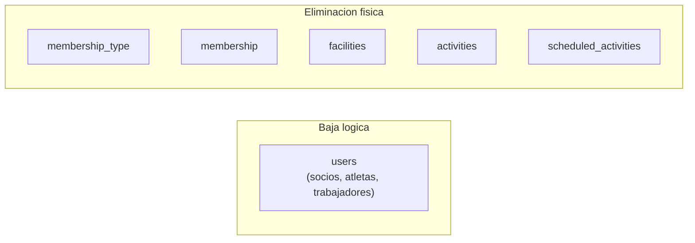
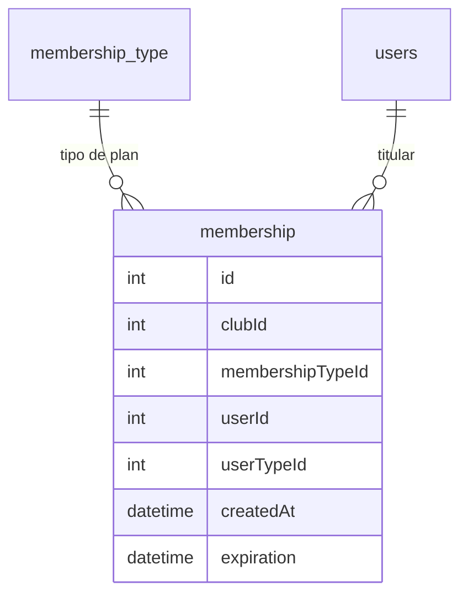
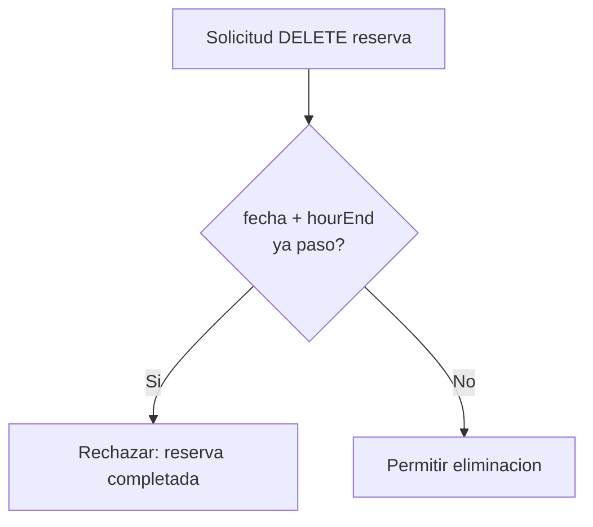
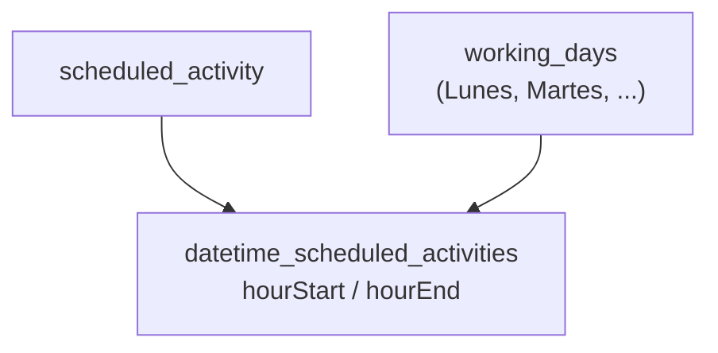

# Reglas de Negocio — Club API REST

Documento de referencia funcional del proyecto **proyecto-club-api-rest**. Define **qué debe cumplir el sistema** en cada dominio de negocio: campos obligatorios, restricciones de unicidad, reglas de eliminación y validaciones críticas.

Para detalles técnicos de implementación (estructura de carpetas, flujo HTTP, tablas Prisma, diagramas ER), consultar [`arquitectura_sistema.md`](arquitectura_sistema.md).

---

## 1. Introducción

### 1.1 Propósito

Este documento es la **fuente de verdad de negocio** para desarrolladores que implementen, revisen o validen features. Cuando haya diferencia entre el código actual y estas reglas, **las reglas de este documento representan el comportamiento objetivo** del sistema.

### 1.2 Relación con la arquitectura

| Documento | Responde a |
|-----------|------------|
| [`arquitectura_sistema.md`](arquitectura_sistema.md) | Cómo está construido el sistema (módulos, capas, BD, flujos) |
| `reglas_negocio.md` (este) | Qué debe hacer el sistema (validaciones, obligatoriedad, restricciones) |

### 1.3 Alcance

Se documentan los siete dominios principales del negocio:

| Módulo NestJS | Dominio | Ruta API |
|---------------|---------|----------|
| `membership_type` | Tipos de membresía | `/membership-type` |
| `users` | Socios, atletas y trabajadores | `/users` |
| `membership` | Membresías de socios/atletas | `/membership` |
| `facilities` | Instalaciones | `/facilities` |
| `activities` | Reservas puntuales | `/activities` |
| `scheduled_activities` | Actividades rutinarias programadas | `/scheduled-activities` |

Módulos auxiliares (`auth`, `time-entries`, `reports`, `user_type`) quedan fuera de alcance, salvo la referencia al catálogo de tipos de usuario en la sección 3.

---

## 2. Principios transversales

Reglas que aplican a **todos** los módulos del alcance.

### 2.1 Multi-tenancy por club

- Cada club opera de forma **aislada**: solo puede crear, editar y eliminar **sus propios** registros.
- El campo `clubId` identifica el club propietario del dato.
- En producción, el `clubId` se obtiene de la **variable de entorno del despliegue** (una instancia de la API por club). El cliente no debe poder elegir libremente un club distinto al suyo.

### 2.2 Identificadores autogenerados

- El `id` de cada entidad se **genera automáticamente** mediante numeradores por club (`numerator` en BD).
- El cliente no envía el `id` al crear un registro nuevo.

### 2.3 Operaciones CRUD

Cada módulo expone las operaciones estándar sobre los datos del club:

| Operación | Descripción |
|-----------|-------------|
| **Crear** | Alta de un nuevo registro con validaciones de negocio |
| **Editar** | Modificación parcial o total de un registro existente del club |
| **Eliminar** | Baja del registro según la estrategia definida por entidad (ver 2.4) |
| **Consultar** | Listado y detalle filtrados por `clubId` |

### 2.4 Estrategias de eliminación

No todas las entidades se eliminan de la misma forma:



| Entidad | Estrategia | Comportamiento |
|---------|------------|----------------|
| `users` (socio, atleta, trabajador) | **Baja lógica** | No se borra el registro; se marca `isActive = false` |
| `membership_type` | Eliminación física | Se elimina el registro de la BD |
| `membership` | Eliminación física | Se elimina el registro de la BD |
| `facilities` | Eliminación física | Se elimina el registro de la BD |
| `activities` (reservas) | Eliminación física | Solo si la reserva **no está completada** (ver sección 9) |
| `scheduled_activities` | Eliminación física | Se elimina el registro de la BD |

### 2.5 Estados activo / inactivo

Entidades con campo `isActive`:

| Valor | Significado en prosa |
|-------|----------------------|
| `isActive: true` | Activo / activa |
| `isActive: false` | Inactivo / inactiva |

Aplica a: `users`, `facilities`, `activities` (reservas).

---

## 3. Catálogo de tipos de usuario

Los usuarios del sistema se discriminan por `typeId`, que referencia la tabla catálogo `user_type`.

| typeId | Nombre | Descripción |
|--------|--------|-------------|
| 1 | Trabajador | Personal del club (entrenadores, administrativos, etc.) |
| 2 | Socio | Miembro estándar del club |
| 3 | Atleta | Miembro con datos deportivos y médicos extendidos |

**Referencia en código:** [`src/users/entities/user.entity.ts`](src/users/entities/user.entity.ts) — enum `UserType`.

> El typeId 4 (`ADMIN`) existe en el enum de dominio pero no forma parte de las reglas de negocio documentadas aquí.

---

## 4. Tipos de membresía (`membership_type`)

### 4.1 Descripción funcional

Un **tipo de membresía** es un plan comercial del club (por ejemplo: Básico, Premium, VIP). Define el **nombre** y el **precio** del plan. Cada club gestiona sus propios tipos de membresía de forma independiente.

Los tipos de membresía se usan como referencia en:

- Membresías activas de socios/atletas (`membership`)
- Instalaciones que habilitan reserva según el plan (`facilities_membership`)
- Actividades rutinarias incluidas en ciertos planes (`scheduled_activities_membership_types`)

### 4.2 Campos

| Campo | Tipo | Obligatorio | Descripción |
|-------|------|-------------|-------------|
| `id` | `number` | Autogenerado | Identificador único dentro del club |
| `clubId` | `number` | Sí | Club propietario (desde entorno) |
| `name` | `string` | Sí | Nombre del plan. **No nulo.** |
| `price` | `number` | Sí | Precio del plan. **No nulo.** Valor numérico ≥ 0. |

### 4.3 Reglas de validación

- `name` y `price` son **obligatorios** en creación y edición.
- `price` debe ser un valor numérico válido (decimal con hasta 2 decimales en BD).
- No se permiten tipos de membresía de otro club.

### 4.4 Operaciones

| Operación | Regla |
|-----------|-------|
| Crear | Alta con `name` y `price` obligatorios |
| Editar | Modificación de `name` y/o `price` |
| Eliminar | Eliminación física del registro |
| Consultar | Solo tipos del club actual |

**Módulo:** [`src/membership_type/`](src/membership_type/) — Ruta: `/membership-type`

---

## 5. Usuarios — Socios y Atletas (`users`, typeId 2 y 3)

### 5.1 Descripción funcional

Los **socios** (typeId = 2) y **atletas** (typeId = 3) son miembros del club. Comparten una estructura base de datos; el atleta extiende al socio con información deportiva y médica obligatoria.

Cada club gestiona de forma independiente el alta, edición y baja de sus socios y atletas.

### 5.2 Campos comunes (socio y atleta)

| Campo | Tipo | Obligatorio | Restricción |
|-------|------|-------------|------------|
| `id` | `number` | Autogenerado | Identificador único dentro del club y tipo |
| `clubId` | `number` | Sí | Desde entorno |
| `email` | `string` | Sí | **Único por club** (`[clubId, email]`) |
| `typeId` | `number` | Sí | `2` = socio, `3` = atleta |
| `membershipTypeId` | `number` | Sí | Tipo de membresía asociado. **No nulo** para socios y atletas |
| `createdAt` | `Date` | Sí | Fecha de alta en el club |
| `isActive` | `boolean` | Sí | `true` = activo, `false` = inactivo |
| `document` | `string` | Sí | **Único por club** (`[clubId, document]`) |

> El campo `name` (nombre completo) también es obligatorio en la implementación actual aunque no se detalla en las reglas originales; se mantiene como requisito técnico del modelo.

### 5.3 Reglas de validación comunes

- `document` no puede repetirse dentro del mismo club.
- `email` no puede repetirse dentro del mismo club.
- `membershipTypeId` debe referenciar un `membership_type` existente del mismo club.
- Solo socios (`typeId = 2`) y atletas (`typeId = 3`) requieren `membershipTypeId`.

### 5.4 Regla de eliminación (baja lógica)

**Eliminar un socio o atleta NO borra el registro de la base de datos.**

La operación DELETE debe:

1. Localizar al usuario por `[id, clubId, typeId]`.
2. Actualizar `isActive = false`.
3. Conservar el historial (membresías, reservas, etc.).

**Referencia en código:** [`src/users/repository/users.repository.impl.ts`](src/users/repository/users.repository.impl.ts) — método `delete`.

### 5.5 Extensión Atleta (typeId = 3)

Si el usuario es de tipo **atleta**, debe completar los siguientes campos adicionales. **Ninguno puede ser nulo** al crear o editar un atleta:

| Campo | Tipo | Descripción |
|-------|------|-------------|
| `gender` | `string` | Género (`male` / `female` o equivalente en español) |
| `weight` | `number` | Peso (kg) |
| `height` | `number` | Altura (cm o m según convención del club) |
| `birthDate` | `Date` | Fecha de nacimiento. No puede ser futura |
| `diet` | `string` | Dieta asignada |
| `trainingPlan` | `string` | Plan de entrenamiento |
| `medicalHistory` | `string` | Historial médico |
| `allergies` | `string` | Alergias conocidas |
| `medications` | `string` | Medicamentos actuales |
| `medicalConditions` | `string` | Condiciones médicas relevantes |

**Referencia en código:** [`src/users/entities/athlete.entity.ts`](src/users/entities/athlete.entity.ts)

### 5.6 Operaciones

| Operación | Regla |
|-----------|-------|
| Crear socio | Campos comunes obligatorios + `membershipTypeId` |
| Crear atleta | Campos comunes + todos los campos de extensión atleta |
| Editar | Validar unicidad de `document`/`email` si cambian |
| Eliminar | Baja lógica (`isActive = false`) |

**Módulo:** [`src/users/`](src/users/) — Ruta: `/users`

---

## 6. Usuarios — Trabajadores (`users`, typeId = 1)

### 6.1 Descripción funcional

Los **trabajadores** son el personal del club. Pueden ser asignados como responsables o asistentes en instalaciones y actividades programadas.

Cada club gestiona de forma independiente el alta, edición y baja de sus trabajadores.

### 6.2 Campos

**Todos los campos son obligatorios. Ninguno puede ser nulo** para un trabajador:

| Campo | Tipo | Descripción |
|-------|------|-------------|
| `id` | `number` | Autogenerado |
| `clubId` | `number` | Desde entorno |
| `email` | `string` | Único por club |
| `typeId` | `number` | Siempre `1` (trabajador) |
| `createdAt` | `Date` | Fecha de alta |
| `isActive` | `boolean` | Estado activo/inactivo |
| `document` | `string` | Único por club |
| `salary` | `number` | Salario del trabajador |
| `hoursToWorkPerDay` | `number` | Horas de trabajo por día |
| `employmentStartDate` | `Date` | Fecha de inicio de empleo |
| `startWorkAt` | `string` | Hora de entrada (formato `HH:mm`) |
| `endWorkAt` | `string` | Hora de salida (formato `HH:mm`) |

### 6.3 Reglas de validación

- `document` y `email` únicos por club (igual que socios/atletas).
- `startWorkAt` debe ser **anterior** a `endWorkAt`.
- `salary` ≥ 0.
- `hoursToWorkPerDay` ≥ 0.

**Referencia en código:** [`src/users/entities/worker.entity.ts`](src/users/entities/worker.entity.ts)

### 6.4 Regla de eliminación (baja lógica)

**Eliminar un trabajador NO borra el registro.** Se marca `isActive = false`, igual que socios y atletas.

### 6.5 Operaciones

| Operación | Regla |
|-----------|-------|
| Crear | Todos los campos obligatorios |
| Editar | Validar horarios y unicidad si cambian |
| Eliminar | Baja lógica (`isActive = false`) |

**Módulo:** [`src/users/`](src/users/) — Ruta: `/users`

---

## 7. Membresías (`membership`)

### 7.1 Descripción funcional

Una **membresía** representa la suscripción de un socio o atleta a un tipo de membresía concreto. Registra cuándo se creó y cuándo vence.

Cada club gestiona las membresías de sus socios y atletas.

### 7.2 Campos

| Campo | Tipo | Obligatorio | Descripción |
|-------|------|-------------|-------------|
| `id` | `number` | Autogenerado | Identificador único dentro del club |
| `clubId` | `number` | Sí | Desde entorno |
| `membershipTypeId` | `number` | Sí | FK a `membership_type` del mismo club |
| `userId` | `number` | Sí | ID del socio o atleta titular |
| `userTypeId` | `number` | Sí | Tipo del usuario (`2` = socio, `3` = atleta) |
| `createdAt` | `Date` | Sí | Fecha de creación de la membresía |
| `expiration` | `Date` | Sí | Fecha de vencimiento (**calculada**, ver 7.3) |

**Ningún campo puede ser nulo.**

### 7.3 Regla de cálculo de vencimiento

La fecha de vencimiento (`expiration`) se **calcula automáticamente** al crear la membresía:

```
expiration = createdAt + 30 días
```

El cliente **no envía** la fecha de vencimiento; el sistema la asigna.

**Referencia en código:** [`src/membership/repository/membership.repository.impl.ts`](src/membership/repository/membership.repository.impl.ts) — método `create`.

### 7.4 Reglas de validación

- `membershipTypeId` debe existir en el mismo club.
- `userId` + `userTypeId` deben referenciar un usuario existente del mismo club con typeId 2 o 3.
- `createdAt` se establece en el momento de la creación.

### 7.5 Diagrama de relaciones



### 7.6 Operaciones

| Operación | Regla |
|-----------|-------|
| Crear | Asignar `expiration = createdAt + 30 días` |
| Editar | Modificar tipo o usuario según reglas de negocio |
| Eliminar | Eliminación física |
| Consultar | Solo membresías del club actual |

**Módulo:** [`src/membership/`](src/membership/) — Ruta: `/membership`

---

## 8. Instalaciones (`facilities`)

### 8.1 Descripción funcional

Una **instalación** es un espacio físico del club (gimnasio, piscina, cancha, etc.) sobre el cual se pueden hacer **reservas** y programar **actividades rutinarias**.

Cada club gestiona sus instalaciones. Define qué tipos de membresía habilitan el uso de cada instalación para reservas.

### 8.2 Campos

| Campo | Tipo | Obligatorio | Descripción |
|-------|------|-------------|-------------|
| `id` | `number` | Autogenerado | Identificador único dentro del club |
| `clubId` | `number` | Sí | Desde entorno |
| `type` | `string` | Sí | Nombre o tipo de instalación (ej. "Sala de musculación") |
| `capacity` | `number` | Sí | Capacidad máxima de personas (mínimo 4) |
| `responsibleWorker` | `number` | **No** | ID del trabajador responsable. **Opcional** |
| `assistantWorkers` | `number[]` | **No** | Lista de IDs de trabajadores asistentes. **Opcional** (puede estar vacía) |
| `membershipTypeIds` | `number[]` | Sí | Tipos de membresía que habilitan reserva en esta instalación |
| `isActive` | `boolean` | Sí | `true` = activa, `false` = inactiva |

### 8.3 Reglas de validación

- `membershipTypeIds` debe contener al menos un tipo de membresía válido del club.
- Si se informa `responsibleWorker`, debe ser un trabajador (`typeId = 1`) activo del club.
- Si se informan `assistantWorkers`, cada ID debe ser un trabajador activo del club.
- `capacity` ≥ 4.

### 8.4 Relaciones en BD

- **Trabajador responsable:** FK directa en tabla `facilities` (`ResponsibleWorkerUserId`).
- **Trabajadores asistentes:** tabla puente `facility_workers`.
- **Tipos de membresía:** tabla puente `facilities_membership`.

### 8.5 Operaciones

| Operación | Regla |
|-----------|-------|
| Crear | Validar membresías y trabajadores referenciados |
| Editar | Actualizar relaciones de trabajadores y membresías |
| Eliminar | Eliminación física (incluye relaciones en tablas puente) |
| Consultar | Solo instalaciones del club actual |

**Módulo:** [`src/facilities/`](src/facilities/) — Ruta: `/facilities`

---

## 9. Reservas (`activities`)

### 9.1 Descripción funcional

Una **reserva** (actividad puntual) es el uso de una instalación en una fecha y horario concretos por un usuario del club. Tiene un costo asociado y un estado activo/inactivo.

El módulo `activities` en código corresponde al dominio de **reservas** en negocio.

### 9.2 Campos

| Campo | Tipo | Obligatorio | Descripción |
|-------|------|-------------|-------------|
| `id` | `number` | Autogenerado | Identificador único dentro del club |
| `clubId` | `number` | Sí | Desde entorno |
| `name` | `string` | Sí | Nombre de la reserva |
| `type` | `string` | Sí | Tipo o categoría de la reserva |
| `date` | `Date` | Sí | Fecha de la reserva |
| `hourStart` | `string` | Sí | Hora de inicio (`HH:mm`) |
| `hourEnd` | `string` | Sí | Hora de fin (`HH:mm`) |
| `facilityId` | `number` | Sí | Instalación donde se realiza |
| `userId` | `number` | Sí | Usuario que hizo la reserva |
| `userTypeId` | `number` | Sí | Tipo del usuario reservante |
| `cost` | `number` | Sí | Costo de la reserva |
| `isActive` | `boolean` | Sí | `true` = activa, `false` = inactiva |

**Ningún campo puede ser nulo.**

### 9.3 Reglas de negocio críticas

#### 9.3.1 Rango horario válido

```
hourStart < hourEnd
```

La hora de inicio debe ser estrictamente anterior a la hora de fin.

#### 9.3.2 Prohibición de solapamiento

**No puede existir otra reserva en la misma instalación, la misma fecha y con horarios que se superpongan.**

Dos rangos horarios se superponen si:

```
hourStart_A < hourEnd_B  AND  hourStart_B < hourEnd_A
```

Esta regla es **más estricta** que prohibir solo reservas con exactamente las mismas horas: también bloquea solapamientos parciales.

**Ejemplo bloqueado:**

| Reserva existente | Nueva reserva | Resultado |
|-------------------|---------------|-----------|
| 10:00 – 12:00 | 11:00 – 13:00 | Rechazada (solapamiento) |
| 10:00 – 12:00 | 10:00 – 12:00 | Rechazada (mismo horario) |
| 10:00 – 12:00 | 12:00 – 14:00 | Permitida (horarios contiguos, sin solapamiento) |

**Referencia en código:** [`src/activities/repository/activities.repository.impl.ts`](src/activities/repository/activities.repository.impl.ts) — método `overlaps`.

#### 9.3.3 Eliminación condicionada

**Solo se pueden eliminar reservas que no se hayan completado.**

Definición operativa de **reserva completada**:

```
reserva completada = (date + hourEnd) < momento actual
```

Es decir: la fecha de la reserva ya pasó **y** la hora de fin también.



Si la reserva aún no ocurrió o está en curso (fecha futura, o fecha hoy pero `hourEnd` no pasó), se permite eliminar.

### 9.4 Operaciones

| Operación | Regla |
|-----------|-------|
| Crear | Validar solapamiento y rango horario |
| Editar | Re-validar solapamiento si cambian fecha/horario/instalación |
| Eliminar | Solo si la reserva **no está completada** |
| Consultar | Solo reservas del club actual |

**Módulo:** [`src/activities/`](src/activities/) — Ruta: `/activities`

---

## 10. Actividades rutinarias (`scheduled_activities`)

### 10.1 Descripción funcional

Una **actividad rutinaria** es una clase o entrenamiento que se repite semanalmente en una instalación determinada (por ejemplo: yoga los lunes y miércoles de 10:00 a 11:30).

A diferencia de las reservas puntuales, las actividades rutinarias se definen por **días de la semana** y pueden tener **múltiples bloques horarios en un mismo día**.

### 10.2 Campos

| Campo | Tipo | Obligatorio | Descripción |
|-------|------|-------------|-------------|
| `id` | `number` | Autogenerado | Identificador único dentro del club |
| `clubId` | `number` | Sí | Desde entorno |
| `name` | `string` | Sí | Nombre de la actividad (ej. "Práctica fútbol") |
| `facilityId` | `number` | Sí | Instalación donde se lleva a cabo |
| `membershipTypesIds` | `number[]` | Sí | Tipos de membresía en los que está incluida |
| `datetimeScheduledActivities` | `object[]` | Sí | Horarios de la actividad (ver 10.3) |
| `userId` | `number` | **No** | Trabajador responsable. **Opcional** |
| `userTypeId` | `number` | **No** | Tipo del responsable (debe ser `1` si se informa). **Opcional** |
| `assistantWorkerIds` | `number[]` | **No** | Trabajadores asistentes. **Opcional** (puede estar vacío) |

### 10.3 Estructura de horarios

Cada elemento de `datetimeScheduledActivities` representa un bloque horario:

| Campo | Tipo | Obligatorio | Descripción |
|-------|------|-------------|-------------|
| `workingDayId` | `number` | Sí | ID del día de la semana (`working_days`) |
| `hourStart` | `string` | Sí | Hora de inicio (`HH:mm`) |
| `hourEnd` | `string` | Sí | Hora de fin (`HH:mm`) |

**Un mismo día puede tener múltiples bloques horarios** en la misma actividad.



**Ejemplo:** Yoga los lunes 10:00–11:30 y 18:00–19:00, y los miércoles 10:00–11:30:

| workingDayId | hourStart | hourEnd |
|--------------|-----------|---------|
| 1 (Lunes) | 10:00 | 11:30 |
| 1 (Lunes) | 18:00 | 19:00 |
| 3 (Miércoles) | 10:00 | 11:30 |

### 10.4 Regla de no duplicación

**No puede haber dos actividades rutinarias en la misma instalación, el mismo día de la semana y con horarios superpuestos.**

La validación compara:

- `facilityId` (misma instalación)
- `workingDayId` (mismo día de la semana)
- Solapamiento de `[hourStart, hourEnd]`

**Referencia en código:** [`src/scheduled_activities/repository/scheduled_activities.repository.impl.ts`](src/scheduled_activities/repository/scheduled_activities.repository.impl.ts) — método `create`.

### 10.5 Operaciones

| Operación | Regla |
|-----------|-------|
| Crear | Validar solapamiento de horarios por instalación y día |
| Editar | Re-validar solapamiento si cambian instalación u horarios |
| Eliminar | Eliminación física |
| Consultar | Solo actividades del club actual |

**Módulo:** [`src/scheduled_activities/`](src/scheduled_activities/) — Ruta: `/scheduled-activities`

---

## 11. Matriz de restricciones de unicidad y conflictos

| Entidad / Dominio | Restricción | Alcance |
|-------------------|-------------|---------|
| `users.document` | Único | Por `[clubId, document]` |
| `users.email` | Único | Por `[clubId, email]` |
| `activity` (reservas) | Sin solapamiento horario | Misma `[facilityId, date]` |
| `scheduled_activities` | Sin solapamiento horario | Misma `[facilityId, workingDayId]` |
| `facility_workers` | Sin duplicados | `[facilityId, userId, clubId, userTypeId]` |

### 11.1 Detección de solapamiento horario

Algoritmo común usado en reservas y actividades rutinarias:

```
solapamiento(A, B) = (hourStart_A < hourEnd_B) AND (hourStart_B < hourEnd_A)
```

Donde las horas se convierten a minutos desde medianoche para comparación numérica.

---

## 12. Referencia cruzada: módulos y archivos

| Dominio | Módulo | Ruta API | Controller | Service | Repository | Schema Prisma |
|---------|--------|----------|------------|---------|------------|---------------|
| Tipos de membresía | `membership_type` | `/membership-type` | [`membership_type.controller.ts`](src/membership_type/membership_type.controller.ts) | [`membership_type.service.ts`](src/membership_type/membership_type.service.ts) | [`membership_type.repository.impl.ts`](src/membership_type/repository/membership_type.repository.impl.ts) | `membership_type` |
| Usuarios | `users` | `/users` | [`users.controller.ts`](src/users/users.controller.ts) | [`users.service.ts`](src/users/users.service.ts) | [`users.repository.impl.ts`](src/users/repository/users.repository.impl.ts) | `users` |
| Membresías | `membership` | `/membership` | [`membership.controller.ts`](src/membership/membership.controller.ts) | [`membership.service.ts`](src/membership/membership.service.ts) | [`membership.repository.impl.ts`](src/membership/repository/membership.repository.impl.ts) | `membership` |
| Instalaciones | `facilities` | `/facilities` | [`facilities.controller.ts`](src/facilities/facilities.controller.ts) | [`facilities.service.ts`](src/facilities/facilities.service.ts) | [`facilities.repository.impl.ts`](src/facilities/repository/facilities.repository.impl.ts) | `facilities`, `facilities_membership`, `facility_workers` |
| Reservas | `activities` | `/activities` | [`activities.controller.ts`](src/activities/activities.controller.ts) | [`activities.service.ts`](src/activities/activities.service.ts) | [`activities.repository.impl.ts`](src/activities/repository/activities.repository.impl.ts) | `activity` |
| Actividades rutinarias | `scheduled_activities` | `/scheduled-activities` | [`scheduled_activities.controller.ts`](src/scheduled_activities/scheduled_activities.controller.ts) | [`scheduled_activities.service.ts`](src/scheduled_activities/scheduled_activities.service.ts) | [`scheduled_activities.repository.impl.ts`](src/scheduled_activities/repository/scheduled_activities.repository.impl.ts) | `scheduled_activities`, `working_days`, `datetime_scheduled_activities` |

### 12.1 Entidades de dominio (POO)

| Tipo de usuario | Archivo de entidad |
|-----------------|-------------------|
| Base | [`user.entity.ts`](src/users/entities/user.entity.ts) |
| Trabajador | [`worker.entity.ts`](src/users/entities/worker.entity.ts) |
| Socio | [`member.entity.ts`](src/users/entities/member.entity.ts) |
| Atleta | [`athlete.entity.ts`](src/users/entities/athlete.entity.ts) |
| Membresía | [`membership.entity.ts`](src/membership/entities/membership.entity.ts) |
| Reserva | [`activity.entity.ts`](src/activities/entities/activity.entity.ts) |
| Instalación | [`facility.entity.ts`](src/facilities/entities/facility.entity.ts) |

---

## 13. Apéndice: brechas conocidas (regla vs implementación)

Esta sección documenta diferencias entre las **reglas de negocio objetivo** (este documento) y el **estado actual del código**. Sirve para priorizar trabajo futuro.

| Regla de negocio | Estado actual | Archivo / notas |
|------------------|---------------|-----------------|
| Soft delete de usuarios/trabajadores (`isActive = false`) | **Implementado** | [`users.repository.impl.ts`](src/users/repository/users.repository.impl.ts) |
| Expiración de membresía = `createdAt + 30 días` | **Implementado** | [`membership.repository.impl.ts`](src/membership/repository/membership.repository.impl.ts) |
| No solapamiento de reservas | **Implementado** | Detección por overlap, no solo igualdad exacta |
| No solapamiento de actividades rutinarias | **Implementado** | [`scheduled_activities.repository.impl.ts`](src/scheduled_activities/repository/scheduled_activities.repository.impl.ts) |
| Eliminar reserva solo si no completada | **Pendiente** | Hoy hace hard delete sin validar fecha/hora |
| Campos atleta todos obligatorios | **Parcial** | DTOs marcan varios campos como `@IsOptional` |
| Trabajador responsable opcional en instalaciones | **Parcial** | [`create-facility.dto.ts`](src/facilities/dto/request/create-facility.dto.ts) lo exige |
| Trabajador responsable opcional en actividades rutinarias | **Parcial** | DTO exige `userId` y `userTypeId` |
| `clubId` desde variable de entorno | **Parcial** | Hoy viene en body/query del request |
| `membershipTypeId` obligatorio al crear socio/atleta | **Parcial** | La membresía se gestiona en módulo separado; no hay FK directa en `users` |

---

## 14. Glosario

| Término | Definición |
|---------|------------|
| **Club** | Organización deportiva que usa el sistema. Unidad de aislamiento de datos (`clubId`). |
| **Tipo de membresía** | Plan comercial (nombre + precio) definido por el club. |
| **Membresía** | Suscripción activa de un socio/atleta a un tipo de membresía, con fecha de vencimiento. |
| **Socio** | Miembro estándar del club (`typeId = 2`). |
| **Atleta** | Miembro con datos deportivos/médicos extendidos (`typeId = 3`). |
| **Trabajador** | Personal del club (`typeId = 1`). |
| **Instalación** | Espacio físico reservable (gimnasio, piscina, cancha, etc.). |
| **Reserva** | Uso puntual de una instalación en fecha y horario concretos (`activity`). |
| **Actividad rutinaria** | Clase o entrenamiento recurrente por días de la semana (`scheduled_activities`). |
| **Baja lógica** | Desactivar un registro (`isActive = false`) sin borrarlo de la BD. |
| **Solapamiento** | Dos rangos horarios que comparten al menos un minuto en común. |
